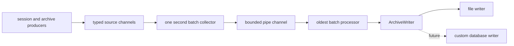

# Historical statistics flow

This page describes how historical archive data is written by the Master-host yagpcc process and how to add a custom archive writer.

## Overview

Historical data is produced from three independent streams:

1. **session statistics** produced by [`SendSessionMetrics`](../internal/master/background.go:324);
2. **finished query statistics** produced from [`ArchiveQuery`](../internal/master/archiver.go:79);
3. **finished segment metrics** produced from [`ArchiveQuery`](../internal/master/archiver.go:79).

The Master background startup creates the source channels in [`InitBG`](../internal/master/background.go:814) and starts the writer pipeline through [`launchArchiveWriters`](../internal/master/background.go:281).

## Writer pipeline

Archive writes are multiplexed through an interface defined in [`archive_writer.go`](../internal/master/archive_writer.go:17). The interface has three batch-oriented methods:

- [`StoreSessions`](../internal/master/archive_writer.go:26) writes session-stat batches;
- [`StoreQuery`](../internal/master/archive_writer.go:29) writes finished-query-stat batches;
- [`StoreSegmensMetrics`](../internal/master/archive_writer.go:33) writes finished-segment-metric batches. The misspelling is kept for compatibility with existing code.

The current implementation is file-based and lives in [`file_writer.go`](../internal/master/file_writer.go:30). It writes JSONL data into rotating files and preserves the historical behavior from the previous implementation.

The processor implementation lives in [`batch_processor.go`](../internal/master/batch_processor.go:30). There are three typed processors, but their behavior is intentionally identical:

1. read messages from a source channel for one batch interval;
2. place one batch into an internal pipe channel;
3. keep up to 60 queued batches by default;
4. process the oldest queued batch;
5. give each write one second by default;
6. count a successful batch as processed;
7. drop the batch on write error or timeout;
8. drop a newly collected batch if the pipe channel is full.

This design prevents the writer from accumulating unbounded historical data during a slow or unavailable archive destination.



## Configuration

Legacy file archive settings remain in [`ArchiverConfigType`](../internal/config/config.go:37) and continue to be used for the file writer:

```yaml
arch_config:
  sessions_file: sessions.json
  queries_file: queries.json
  segments_file: segments.json
  max_file_size: 419430400
```

A forward-compatible writer configuration section is available through [`WriterConfig`](../internal/config/config.go:54) and [`WriterTarget`](../internal/config/config.go:71). It is intended for future writer implementations such as ClickHouse or Greenplum database sinks:

```yaml
writers:
  batch_interval: 1s
  write_timeout: 1s
  batch_queue_size: 60
  targets:
    - type: file
      enabled: true
      sessions_file: sessions.json
      queries_file: queries.json
      segments_file: segments.json
      max_file_size: 419430400
```

At the moment only the file writer is implemented and wired at startup.

## Metrics

Writer pipeline metrics are defined in [`YagpccMetricsType`](../internal/metrics/metrics.go:23) and initialized by [`InitMetrics`](../internal/app/app.go:226):

- `writer_processed_messages_total{stream="sessions|queries|segments"}` — messages written successfully;
- `writer_dropped_messages_total{stream="sessions|queries|segments"}` — messages dropped due to write failure, timeout, full pipe, or shutdown;
- `writer_duration_seconds{stream="sessions|queries|segments"}` — write duration per processed batch attempt;
- `writer_batch_size{stream="sessions|queries|segments"}` — collected batch sizes;
- `writer_queued_batches{stream="sessions|queries|segments"}` — reserved for queue pressure reporting.

## Adding a custom database writer

To add an archive writer for your own database, use the file writer as a reference and implement the same interface.

### 1. Create a writer implementation

Add a new file under [`internal/master`](../internal/master), for example `mydb_writer.go`, and implement the interface from [`archive_writer.go`](../internal/master/archive_writer.go:17):

```go
package master

import (
    "context"

    pbm "github.com/open-gpdb/yagpcc/api/proto/agent_master"
    "github.com/open-gpdb/yagpcc/internal/gp"
)

type MyDBWriter struct {
    // client, connection pool, logger, settings, etc.
}

func (w *MyDBWriter) StoreSessions(ctx context.Context, sessions []*gp.SessionDataWrite) error {
    // Convert sessions to rows and write them using ctx.
    return nil
}

func (w *MyDBWriter) StoreQuery(ctx context.Context, queries []*pbm.QueryStatWrite) error {
    // Convert query stats to rows and write them using ctx.
    return nil
}

func (w *MyDBWriter) StoreSegmensMetrics(ctx context.Context, metrics []*pbm.SegmentMetricsWrite) error {
    // Convert segment metrics to rows and write them using ctx.
    return nil
}
```

Important implementation rules:

- respect the incoming `ctx`; it carries the one-second write deadline;
- return an error if the batch cannot be fully written; the pipeline will drop that batch and continue;
- do not block forever or retry outside the received context;
- keep methods batch-oriented, because they are called once per pipe batch;
- make writes idempotent if your database can receive duplicate batches after future retries or multi-target fan-out are added.

### 2. Add configuration

Extend [`WriterTarget`](../internal/config/config.go:71) with settings for your target, or create a nested config object if the target requires many fields. Example:

```yaml
writers:
  targets:
    - type: mydb
      enabled: true
      dsn: postgres://archive-user@example/archive
```

Keep existing file archive fields in [`arch_config`](../internal/config/config.go:88) unchanged for backward compatibility.

### 3. Wire the writer at startup

Update [`launchArchiveWriters`](../internal/master/background.go:281) so it constructs your writer when the matching target type is enabled. Then pass your writer methods into the existing processors:

```go
go RunSessionBatchProcessor(ctx, logger, batchConfig, sessChan, myWriter.StoreSessions)
go RunQueryBatchProcessor(ctx, logger, batchConfig, queryChan, myWriter.StoreQuery)
go RunSegmentBatchProcessor(ctx, logger, batchConfig, segChan, myWriter.StoreSegmensMetrics)
```

For the first custom implementation, keep only one enabled target at a time unless you also implement explicit multi-target fan-out semantics.

### 4. Add tests

Add focused tests near [`batch_processor_test.go`](../internal/master/batch_processor_test.go:36):

- successful session, query, and segment batch writes;
- write error causes a dropped batch;
- context timeout is respected;
- config is parsed and validated;
- no unbounded accumulation occurs when the writer is slow.

Run [`make unittest`](../Makefile) before submitting changes.
