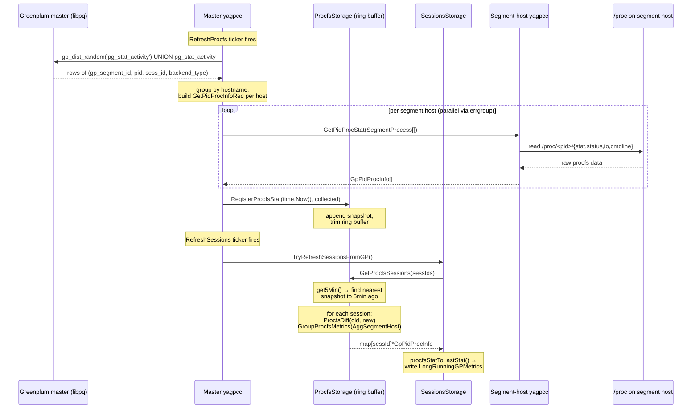

# Per-process resource statistics

This document describes how yagpcc collects per-process Linux procfs data
(`/proc/<pid>/{stat,status,io,cmdline}`) for every Greenplum / Cloudberry
backend across the cluster, attributes it to the running session, and
exposes 5-minute rolling deltas on the master via the existing
`LastMetrics` field on `SessionState`.

For the broader picture see [Architecture overview](./architecture.md) and
[Service architecture](./service-architecture.md). For the user-facing API
see [API description](./API.md).

---

## 1. Schema and per-session cluster-wide flow

The data flow has three stages: PID discovery on the master, a per-host
gRPC fan-out to segment-host yagpccs, and snapshot storage + diff-based
aggregation back on the master.

### 1.1 PID discovery (master, via libpq)

The master yagpcc already maintains a background list of every Greenplum
backend (master + every segment) by polling
`gp_dist_random('pg_stat_activity') UNION ALL pg_stat_activity` from the
Greenplum master.

| Item | Location |
|------|----------|
| Cloudberry/GP6 query text | `cloudberryAllSessionsQuery` / `gp6AllSessionsQuery` in [internal/gp/stat_activity/lister.go](../internal/gp/stat_activity/lister.go) |
| Polling cadence | `WithBackgroundAllSessionsCollectionInterval` (default `60s`, see `newBackgroundAllSessions` in [internal/gp/stat_activity/lister.go](../internal/gp/stat_activity/lister.go)) |
| Cache TTL | `WithBackgroundAllSessionsCacheTTL` (default `600s`) |
| Row type | `SessionPid{GpSegmentId, Pid, SessId, BackendType}` in [internal/gp/stat_activity/models.go](../internal/gp/stat_activity/models.go) |
| Read accessor | `Lister.ListAllSessions(ctx)` |

A row of `SessionPid` carries everything we need to address a single
process from the master: its hosting segment id, its OS pid, the
Greenplum `sess_id` it belongs to, and (on Cloudberry) `backend_type`
(`client backend`, `walwriter`, …).

`gp_segment_id` is then resolved to a hostname via the existing segment
topology that the master pulls from `gp_segment_configuration` (see
[internal/master/background.go](../internal/master/background.go)).

### 1.2 Per-host fan-out (master → segment-host yagpcc, gRPC)

The master groups the latest `[]SessionPid` by the segment-host that
owns each `gp_segment_id` and issues one or more `GetPidProcStat` calls
per host. This is implemented in
[`ProcfsGatherStorage`](../internal/master/procfs_gather.go), which is
separate from the existing `segChan` puller machinery used for
`GetMetricQueries`.

The fan-out works as follows:

1. [`GatherProcfsStat()`](../internal/master/procfs_gather.go) calls
   `ListAllSessions(ctx)` to get the current PID list.
2. [`getJobsMap()`](../internal/master/procfs_gather.go) groups sessions
   by hostname (resolved via
   [`GetHostnameForSegindex()`](../internal/storage/config_storage.go)).
3. An `errgroup` launches one goroutine per host, each calling
   [`processProcfsRequests()`](../internal/master/procfs_gather.go).
4. Each goroutine opens a gRPC connection to the segment-host yagpcc and
   sends `GetPidProcStat` requests, batching up to `jobsPerQuery = 1000`
   `SegmentProcess` entries per RPC call to stay within message size
   limits.
5. Results from all hosts are collected under a mutex and returned as a
   flat `[]*GpPidProcInfo`.

Request and response messages are defined in:

```
// api/proto/agent_segment/yagpcc_get_service.proto

service GetQueryInfo {
    rpc GetMetricQueries (GetQueriesInfoReq) returns (GetQueriesInfoResponse) {}
    rpc GetPidProcStat   (GetPidProcInfoReq) returns (GetPidProcInfoResponse) {}
}

message SegmentProcess {
    int64 gp_segment_id = 1;
    int64 sess_id       = 2;
    int64 pid           = 3;
}

message GetPidProcInfoReq {
    repeated SegmentProcess segment_process = 1;
}

message GetPidProcInfoResponse {
    repeated GpPidProcInfo pid_proc_data = 1;
}
```

`GpPidProcInfo` (defined in
[api/proto/common/yagpcc_metrics.proto](../api/proto/common/yagpcc_metrics.proto))
carries the primary key (`gp_segment_id`, `sess_id`, `pid`), the process
`cmdline`, and the parsed `ProcStat` (from `/proc/<pid>/stat`),
`ProcStatus` (from `/proc/<pid>/status`), and `ProcIO` (from
`/proc/<pid>/io`):

```
message GpPidProcInfo {
    int64       gp_segment_id = 1;
    int64       sess_id       = 2;
    int64       pid           = 3;
    string      cmdline       = 4;
    ProcStat    proc_stat     = 5;
    ProcStatus  proc_status   = 6;
    ProcIO      proc_io       = 7;
}

message ProcIO {
    int64 rchar                  = 1;  // bytes read via read-like syscalls
    int64 wchar                  = 2;  // bytes written via write-like syscalls
    int64 syscr                  = 3;  // read syscall count
    int64 syscw                  = 4;  // write syscall count
    int64 read_bytes             = 5;  // bytes fetched from storage
    int64 write_bytes            = 6;  // bytes sent to storage
    int64 cancelled_write_bytes  = 7;  // writes never persisted
}
```

All `ProcIO` fields are cumulative kernel counters. The master computes
**deltas** between two snapshots to derive interval-based metrics (see
§1.4). The numeric fields in `ProcStat`, `ProcStatus`, and `ProcIO` are
intentionally **signed** (`int32` / `int64` rather than the `uint*` types
used by `prometheus/procfs`) so the same layout can also carry deltas
without needing a parallel signed-delta schema. Counter values themselves
never exceed `2^63` for any realistic process lifetime, so the conversion
is lossless.

### 1.3 Segment side (stateless)

The segment-host yagpcc keeps **no local state** for proc-stats. On every
`GetPidProcStat` call it:

1. Iterates the `SegmentProcess` entries from the request.
2. For each `(gp_segment_id, sess_id, pid)` reads
   `/proc/<pid>/stat`, `/proc/<pid>/status`, `/proc/<pid>/io`,
   `/proc/<pid>/cmdline` via
   [`GetPidProcInfo()`](../internal/utils/procfs.go).
3. Skips entries where the process has already exited
   (`ErrProcessNotFound` / `ENOENT`) so that the master can detect
   process disappearance from the missing key alone.
4. If some PIDs error but at least one succeeds, returns the partial
   result. Only returns an error if **all** PIDs fail.
5. Returns the assembled `[]GpPidProcInfo`.

The handler is implemented in
[`GetQueryInfoServer.GetPidProcStat()`](../internal/grpc/get_query_info.go)
and is registered on both segment and master roles in
[`NewApp()`](../internal/app/app.go).

Note that `/proc/<pid>/io` counters (`read_bytes`, `write_bytes`,
`rchar`, `wchar`, `syscr`, `syscw`, `cancelled_write_bytes`) are also
surfaced through the `SystemStat` portion of the hook-collected
`GPMetrics` documented in
[API.md → SystemStat (procfs)](./API.md#systemstat-procfs). That path
delivers data only when the `yagp-hooks-collector` extension is loaded
in Greenplum and only for queries it can hook. `GetPidProcStat` is the
authoritative path for per-tick procfs sampling and works for every
backend in `pg_stat_activity` (including system processes that
`yagp-hooks-collector` never sees).

### 1.4 Master aggregation (snapshot-pair diffing, per session)

The master does **not** use EMA (exponential moving averages). Instead,
it stores raw snapshots in a ring buffer and computes deltas between any
two snapshots on demand.

The flow is driven by two independent ticker goroutines launched in
[`InitBG()`](../internal/master/background.go):

**Gather loop** — [`RefreshProcfs()`](../internal/master/background.go):

1. Fires every `procfs_refresh_interval` (config).
2. Creates a [`ProcfsGatherStorage`](../internal/master/procfs_gather.go)
   and calls `GatherProcfsStat()` to fan out to all segment hosts.
3. Calls
   [`ProcfsStorage.RegisterProcfsStat(time.Now(), result)`](../internal/storage/procfs_storage.go)
   to append the gathered `[]*GpPidProcInfo` as a new timestamped
   snapshot in the ring buffer.
4. `RegisterProcfsStat` builds two maps for fast access:
   - `pidProcData` (`ProcMap`): keyed by `ProcKey{GpSegmentId, SessId, Pid}` → `*ProcStat`
   - `pidProcIndex` (`ProcIndexMap`): keyed by `ProcIndexKey{SessId}` → `[]*ProcIndexData{GpSegmentId, Pid}`
5. Calls `TidyUpProcfsStat()` to trim the ring buffer to
   `maximumStoredPoints` (default 30).

**Session refresh loop** — [`RefreshSessions()`](../internal/master/background.go):

1. Fires every `session_refresh_interval`.
2. Calls
   [`TryRefreshSessionsFromGP()`](../internal/master/background.go)
   which, after refreshing the session list, calls
   [`RecalculateProcfsUsage()`](../internal/gp/sessions.go).
3. `RecalculateProcfsUsage()` collects all session IDs and calls
   [`ProcfsStorage.GetProcfsSessions(sessIds)`](../internal/storage/procfs_storage.go).
4. `GetProcfsSessions()` calls `get5Min()` to find the snapshot nearest
   to 5 minutes ago and pairs it with the latest snapshot.
5. For each session, [`getProcfsSession()`](../internal/storage/procfs_storage.go)
   iterates all `(GpSegmentId, Pid)` entries from the session's index in
   the **latest** snapshot, computes per-process deltas via
   [`ProcfsDiff()`](../internal/storage/procfs_group.go), and aggregates
   across segments via
   [`GroupProcfsMetrics()`](../internal/storage/procfs_group.go) using
   `AggSegmentHost` aggregation.
6. The aggregated `GpPidProcInfo` is converted to `GPMetrics` via
   [`procfsStatToLastStat()`](../internal/gp/sessions.go) and written
   into `SessionData.LongRunningGPMetrics`.

This means each session's `LastMetrics` (exposed on `SessionState` via
the existing `GetGPSessions` / `GetGPQuery` RPCs) contains the
**5-minute delta** of cluster-wide procfs counters for that session:

| `LastMetrics.SystemStat` field | Source |
|-------------------------------|--------|
| `UserTimeSeconds` | `Σ_segments Δ(ProcStat.Utime)` |
| `KernelTimeSeconds` | `Σ_segments Δ(ProcStat.Stime)` |
| `Vsize` | per-host sum of `ProcStat.Vsize` (latest snapshot) |
| `Rss` | per-host sum of `ProcStat.Rss` (latest snapshot) |
| `Rchar` | `Σ_segments Δ(ProcIO.Rchar)` |
| `Wchar` | `Σ_segments Δ(ProcIO.Wchar)` |
| `Syscr` | `Σ_segments Δ(ProcIO.Syscr)` |
| `Syscw` | `Σ_segments Δ(ProcIO.Syscw)` |
| `ReadBytes` | `Σ_segments Δ(ProcIO.ReadBytes)` |
| `WriteBytes` | `Σ_segments Δ(ProcIO.WriteBytes)` |
| `CancelledWriteBytes` | `Σ_segments Δ(ProcIO.CancelledWriteBytes)` |

The `Δ` notation means `nonNegativeDiff(first, last)` — if the counter
decreased (PID reuse or counter reset), the diff is clamped to zero.

Memory metrics (`Vsize`, `Rss`) use `AggSegmentHost` aggregation: within
a single host, values from multiple processes are summed into an
intermediate map keyed by `(MetricName, Hostname)`, then the per-host
total is used as the final value. This avoids double-counting when
multiple segments on the same host report the same process.

### 1.5 End-to-end sequence



---

## 2. Storage architecture on the master

### 2.1 Ring-buffer snapshot store

Instead of maintaining per-process delta state and computing EMA rolling
averages, the master stores **raw snapshots** in a fixed-size ring buffer.
Any two snapshots can be diffed on demand to produce deltas over the
corresponding time window.

This design is simple, stateless between ticks, and naturally handles:

- **Missed ticks** — the ring buffer just has fewer snapshots; the
  nearest-snapshot search still works.
- **PID reuse** — `nonNegativeDiff()` clamps negative deltas to zero,
  so a counter reset produces a zero delta rather than a spike.
- **Process disappearance** — if a PID is absent from the latest
  snapshot, it simply doesn't contribute to the session's aggregated
  metrics.

### 2.2 Storage types

```go
// internal/storage/procfs_storage.go

type ProcKey struct {
    GpSegmentId int64
    SessId      int64
    Pid         int64
}

type ProcIndexKey struct {
    SessId int64
}

type ProcIndexData struct {
    GpSegmentId int64
    Pid         int64
}

type ProcStat struct {
    Cmdline    string
    State      string
    ProcStat   *pbc.ProcStat
    ProcStatus *pbc.ProcStatus
    ProcIO     *pbc.ProcIO
}

type ProcMap      map[ProcKey]*ProcStat
type ProcIndexMap map[ProcIndexKey][]*ProcIndexData

type ProcfsStatType struct {
    statTime     time.Time
    pidProcData  ProcMap       // primary: (seg, sess, pid) → stats
    pidProcIndex ProcIndexMap  // secondary: sess → [(seg, pid), ...]
}

type ProcfsStorage struct {
    mx                  *sync.RWMutex
    procfsStat          []ProcfsStatType  // ring buffer, newest last
    maximumStoredPoints int               // default 30
}
```

Each snapshot (`ProcfsStatType`) contains:

- `statTime` — when the snapshot was taken.
- `pidProcData` — a map from `ProcKey{GpSegmentId, SessId, Pid}` to the
  parsed procfs data for that process.
- `pidProcIndex` — a secondary index from `ProcIndexKey{SessId}` to the
  list of `(GpSegmentId, Pid)` pairs belonging to that session, enabling
  efficient per-session lookups.

### 2.3 Snapshot lookup

[`getNearestNTimeUnlocked(d)`](../internal/storage/procfs_storage.go)
searches the ring buffer for the snapshot whose age (relative to the
newest snapshot) is closest to duration `d`. Since snapshots are stored
in chronological order, the search walks backwards from the newest entry
and stops as soon as the absolute difference starts growing (early exit).

Convenience wrappers:

| Method | Window |
|--------|--------|
| `get5Min()` | 5 minutes |
| `get15Min()` | 15 minutes |
| `get30Min()` | 30 minutes |

Currently, `GetProcfsSessions()` uses `get5Min()` to produce the
per-session deltas exposed via `LastMetrics`.

### 2.4 Diff and aggregation

**Per-process diff** —
[`ProcfsDiff(first, last)`](../internal/storage/procfs_group.go) produces
a `GpPidProcInfo` where:

- Snapshot fields (`Pid`, `Comm`, `State`, `Cmdline`, `ProcStatus`, …)
  are taken from `last`.
- Cumulative counters (`Utime`, `Stime`, `MinFlt`, `MajFlt`, `Rchar`,
  `WriteBytes`, …) are diffed via `nonNegativeDiff(first, last)` — if
  `last < first` (counter reset / PID reuse), the result is `0`.

**Per-session aggregation** —
[`GroupProcfsMetrics(dest, source, aggKind, segHostname, intermediateResults)`](../internal/storage/procfs_group.go)
merges one process's diff into a session-level accumulator:

- CPU counters (`Utime`, `Stime`, `Cutime`, `Cstime`, `GuestTime`,
  `CguestTime`) are **summed** across all segments.
- IO counters (`Rchar`, `Wchar`, `Syscr`, `Syscw`, `ReadBytes`,
  `WriteBytes`, `CancelledWriteBytes`) are **summed** across all
  segments.
- Memory gauges (`Vsize`, `Rss`) use an intermediate map keyed by
  `(MetricName, Hostname)` to first sum within each host, then either
  take the per-host value (`AggSegmentHost`) or the max across hosts
  (`AggMax`). The per-session path uses `AggSegmentHost`.

### 2.5 Lifecycle / eviction

- **Ring buffer trimming** —
  [`TidyUpProcfsStat()`](../internal/storage/procfs_storage.go) is called
  after every `RegisterProcfsStat()`. If the buffer exceeds
  `maximumStoredPoints`, the oldest snapshots are discarded.
- **No per-PID GC** — individual processes are not tracked across ticks.
  If a PID disappears from a snapshot, it simply won't appear in the
  diff. If a session disappears from `pg_stat_activity`, it is removed
  from `SessionsStorage` by `RefreshSessionList()` (when
  `clearDeletedSessions` is enabled), and its procfs data naturally
  stops being queried.

### 2.6 Exposure via existing gRPC surface

No new proto messages or RPCs were added. Procfs data is exposed through
the existing `SessionState.LastMetrics` field:

1. [`RecalculateProcfsUsage()`](../internal/gp/sessions.go) iterates all
   sessions and calls `GetProcfsSessions()`.
2. For each session with procfs data,
   [`procfsStatToLastStat()`](../internal/gp/sessions.go) converts the
   aggregated `GpPidProcInfo` into a `GPMetrics` with a populated
   `SystemStat`:

   ```go
   result.SystemStat = &pbc.SystemStat{
       UserTimeSeconds:   float64(procfsStat.ProcStat.Utime),
       KernelTimeSeconds: float64(procfsStat.ProcStat.Stime),
       Vsize:             uint64(procfsStat.ProcStat.Vsize),
       VmSizeKb:          uint64(procfsStat.ProcStat.Vsize) / 1024,
       Rss:               uint64(procfsStat.ProcStat.Rss),
       // ProcIO fields mapped to SystemStat IO fields...
   }
   ```

3. This is written to `SessionData.LongRunningGPMetrics`, which is
   exposed as `LastMetrics` on `SessionState` in the existing
   `GetGPSessions` / `GetGPQuery` RPCs.

Consumers calling `GetGPSessions` or `GetGPQuery` see the 5-minute
cluster-wide CPU / RSS / IO deltas for each session in `LastMetrics`,
alongside any hook-collected metrics in `TotalMetrics` and
`QueryMetrics`.

### 2.7 Configuration

| Knob | Default | Defined in |
|------|---------|------------|
| `procfs_refresh_interval` | per yagpcc.yaml | [internal/config/config.go](../internal/config/config.go) — `ProcfsRefreshInterval` |
| `segment_pull_threads` | per yagpcc.yaml | [internal/config/config.go](../internal/config/config.go) — used as `nPullers` for errgroup concurrency |
| `max_message_size` | per yagpcc.yaml | [internal/config/config.go](../internal/config/config.go) — gRPC max receive message size |
| `maximumStoredPoints` | `30` | [internal/storage/procfs_storage.go](../internal/storage/procfs_storage.go) — `WithMaximumStoredPoints()` option |
| `WithBackgroundAllSessionsCollectionInterval` | `60s` | [internal/gp/stat_activity/lister.go](../internal/gp/stat_activity/lister.go) — PID list refresh cadence |
| `WithBackgroundAllSessionsCacheTTL` | `600s` | same |

---

## 3. Out of scope / future work

The following are **not** part of the current implementation and may be
considered as future enhancements:

- **EMA-based rolling averages** — the current implementation uses
  simple snapshot-pair diffing over a fixed window (5 min). A future
  enhancement could add exponential moving averages with configurable
  time constants (e.g. 5 / 15 / 30 min) for smoother `top`-style
  output.
- **`GetClusterTop` RPC** — a dedicated RPC returning cluster-wide
  rollup metrics sorted by resource usage.
- **`ProcAvg` proto message** — a dedicated message for per-session
  rolling averages on `SessionState`.
- **Per-query attribution** — the current implementation attributes
  procfs data to **sessions** (via `SessId`). Attributing to specific
  running queries (via `(SessId, Ccnt)`) would require correlating
  procfs snapshots with query start/end times.
- **Configurable diff windows** — currently hardcoded to 5 minutes in
  `GetProcfsSessions()`. Making the window configurable (or exposing
  5 / 15 / 30 min variants) would allow consumers to choose their
  preferred time horizon.
